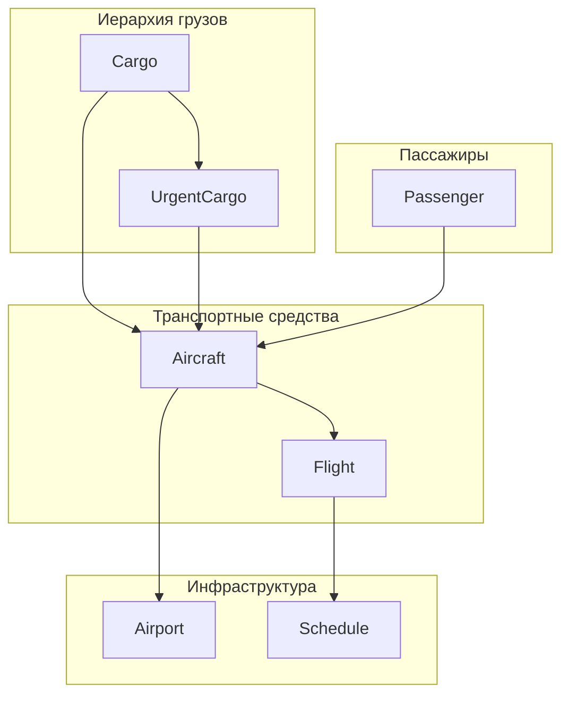

# Система управления авиаперевозками

## Обзор программы

Данная программа представляет собой комплексную систему управления авиаперевозками, написанную на языке C++. Система моделирует работу авиакомпании с управлением рейсами, самолётами, грузами, пассажирами и аэропортами.

## Схема иерархии классов



## Детальное описание классов

### 1. Класс Cargo (Базовый класс для грузов)

**Назначение**: Базовый класс для представления грузов в системе авиаперевозок.

**Основные поля**:
- `cargoNumber` (string) - уникальный номер груза
- `mass` (double) - масса груза в килограммах
- `departureAirport` (string) - аэропорт отправления
- `destinationAirport` (string) - аэропорт назначения
- `currentAirport` (string) - текущее местоположение груза
- `arrivalTime` (time_t) - время прибытия в аэропорт отправления

**Ключевые методы**:
- `moveToAirport()` - перемещение груза в указанный аэропорт
- `hasReachedDestination()` - проверка достижения места назначения
- `toString()` - строковое представление объекта
- `isValid()` - проверка корректности данных

**Операторы сравнения**: Реализованы по массе груза (==, !=, <, <=, >, >=)

### 2. Класс UrgentCargo (Наследник Cargo)

**Назначение**: Специализированный класс для срочных грузов с ограниченным временем доставки.

**Дополнительные поля**:
- `deadline` (time_t) - крайняя дата доставки до аэропорта назначения

**Специфичные методы**:
- `isOverdue()` - проверка просрочки груза
- `isUrgent()` - проверка срочности (менее 24 часов до дедлайна)
- `getDaysUntilDeadline()` - количество дней до крайнего срока

**Особенности**:
- Переопределяет методы `toString()` и `isValid()` базового класса
- Добавляет префикс "URGENT" в строковом представлении
- Включает информацию о дедлайне и статусе срочности

### 3. Класс Passenger (Пассажиры)

**Назначение**: Представление пассажиров авиарейсов.

**Основные поля**:
- `passengerNumber` (string) - номер пассажира
- `name` (string) - имя пассажира
- `departureAirport` (string) - аэропорт отправления
- `destinationAirport` (string) - аэропорт назначения
- `FIXED_MASS` (const double) - фиксированная масса 80 кг

**Особенности**:
- Все пассажиры имеют одинаковую массу (80 кг)
- Операторы сравнения реализованы по массе (всегда равны)
- Простая структура без сложной логики перемещения

### 4. Класс Aircraft (Самолёт)

**Назначение**: Управление самолётом и его грузом/пассажирами.

**Основные поля**:
- `aircraftNumber` (string) - номер самолёта
- `maxPayload` (double) - максимальная грузоподъёмность
- `cargoList` (vector<shared_ptr<Cargo>>) - список обычных грузов
- `urgentCargoList` (vector<shared_ptr<UrgentCargo>>) - список срочных грузов
- `passengerList` (vector<shared_ptr<Passenger>>) - список пассажиров

**Ключевые методы**:
- `addCargo()`, `addUrgentCargo()`, `addPassenger()` - добавление грузов/пассажиров
- `canCarry()` - проверка возможности взять дополнительный груз
- `getCurrentPayload()` - получение текущей загрузки
- `getAvailableCapacity()` - получение доступной грузоподъёмности
- `clearAll()` - очистка всех грузов и пассажиров

**Особенности**:
- Использует `shared_ptr` для безопасного управления памятью
- Проверяет грузоподъёмность при добавлении грузов
- Поддерживает поиск по номерам грузов/пассажиров

### 5. Класс Airport (Аэропорт)

**Назначение**: Управление аэропортом и его ресурсами.

**Основные поля**:
- `name` (string) - название аэропорта
- `cargoList` (vector<shared_ptr<Cargo>>) - грузы в аэропорту
- `urgentCargoList` (vector<shared_ptr<UrgentCargo>>) - срочные грузы
- `passengerList` (vector<shared_ptr<Passenger>>) - пассажиры
- `aircraftList` (vector<shared_ptr<Aircraft>>) - самолёты в аэропорту

**Ключевые методы**:
- `addCargo()`, `addUrgentCargo()`, `addPassenger()`, `addAircraft()` - добавление объектов
- `getTotalCargoWeight()` - общий вес всех грузов
- `getOverdueCargo()` - получение просроченных срочных грузов
- `findCargo()`, `findPassenger()`, `findAircraft()` - поиск по номерам

**Особенности**:
- Центральный узел для хранения всех объектов системы
- Поддерживает поиск и фильтрацию по различным критериям
- Использует предварительное объявление для избежания циклических зависимостей

### 6. Класс Flight (Рейс)

**Назначение**: Представление авиарейса с полной информацией о маршруте и времени.

**Основные поля**:
- `flightNumber` (string) - номер рейса
- `departureAirport` (string) - аэропорт отправления
- `destinationAirport` (string) - аэропорт назначения
- `departureTime` (time_t) - время отправления
- `arrivalTime` (time_t) - время прибытия
- `aircraftId` (string) - идентификатор самолёта
- `completed` (bool) - флаг завершения рейса

**Ключевые методы**:
- `getFlightDuration()`, `getFlightDurationHours()` - расчёт продолжительности
- `isInProgress()`, `isScheduled()` - проверка статуса рейса
- `createReturnFlight()` - создание обратного рейса
- `unloadCargoAndPassengers()` - выгрузка по прибытии
- `conflictsWith()` - проверка конфликтов с другими рейсами

**Операторы сравнения**: Реализованы по времени отправления

**Особенности**:
- Автоматическое создание обратных рейсов
- Проверка конфликтов по времени и самолёту
- Форматированный вывод с датами и временем

### 7. Класс Schedule (Расписание)

**Назначение**: Управление расписанием полётов с проверкой корректности.

**Основные поля**:
- `flights` (vector<shared_ptr<Flight>>) - упорядоченный список рейсов

**Ключевые методы**:
- `addFlight()`, `removeFlight()`, `findFlight()` - управление рейсами
- `isValid()` - проверка корректности расписания
- `getValidationErrors()` - получение списка ошибок
- `validateAndFix()` - автоматическое исправление ошибок
- `getFlightsByAircraft()`, `getFlightsByAirport()` - фильтрация рейсов
- `getTotalFlightTime()` - расчёт времени полётов
- `getOverworkedAircraft()` - поиск перегруженных самолётов

**Особенности**:
- Автоматическая сортировка по времени отправления
- Проверка конфликтов между рейсами
- Анализ загрузки самолётов
- Поддержка временных диапазонов

## Архитектурные особенности

### 1. Управление памятью
- Использование `std::shared_ptr` для автоматического управления памятью
- Избежание утечек памяти и двойного освобождения
- Безопасное копирование объектов

### 2. Наследование и полиморфизм
- `UrgentCargo` наследует от `Cargo`
- Переопределение виртуальных методов (`toString()`, `isValid()`)
- Использование указателей на базовый класс

### 3. Инкапсуляция
- Все поля классов объявлены как `private`
- Доступ через геттеры и сеттеры
- Валидация данных при установке значений

### 4. Перегрузка операторов
- Операторы сравнения для всех основных классов
- Логические операторы (==, !=, <, <=, >, >=)
- Семантически корректное сравнение

## Основные функции системы

### 1. Управление грузами
- Создание и отслеживание обычных и срочных грузов
- Проверка срочности и просрочки
- Перемещение между аэропортами

### 2. Управление пассажирами
- Регистрация пассажиров на рейсы
- Отслеживание маршрутов
- Учёт массы пассажиров

### 3. Управление самолётами
- Контроль грузоподъёмности
- Загрузка и выгрузка грузов/пассажиров
- Поиск и фильтрация

### 4. Управление аэропортами
- Централизованное хранение объектов
- Поиск и фильтрация по различным критериям
- Статистика и отчёты

### 5. Управление рейсами
- Планирование и отслеживание рейсов
- Проверка конфликтов
- Создание обратных рейсов

### 6. Управление расписанием
- Автоматическая сортировка
- Валидация и исправление ошибок
- Анализ загрузки и статистика

## Тестирование

Программа включает два основных тестовых модуля:

1. **test_cargo.cpp** - тестирование базового класса Cargo
2. **test_hierarchy.cpp** - тестирование всей иерархии классов

Тесты проверяют:
- Корректность создания объектов
- Работу операторов сравнения
- Наследование и полиморфизм
- Валидацию данных
- Основную функциональность системы

## Использование

### Компиляция
```bash
# Windows (Visual Studio)
build.bat

# Или PowerShell
build.ps1
```

### Запуск
```bash
./Cargo_5th_term.exe
```

### Основной функционал
1. Создание объектов (грузов, пассажиров, самолётов, аэропортов)
2. Планирование рейсов
3. Загрузка самолётов
4. Управление расписанием
5. Анализ и отчёты

## Заключение

Данная система представляет собой полнофункциональную модель управления авиаперевозками с использованием современных принципов объектно-ориентированного программирования. Архитектура позволяет легко расширять функциональность и добавлять новые типы объектов.

**Ключевые преимущества**:
- Чёткая иерархия классов
- Безопасное управление памятью
- Полная инкапсуляция
- Расширяемость и масштабируемость
- Комплексное тестирование

Система готова к использованию и может служить основой для более сложных систем управления авиаперевозками.
